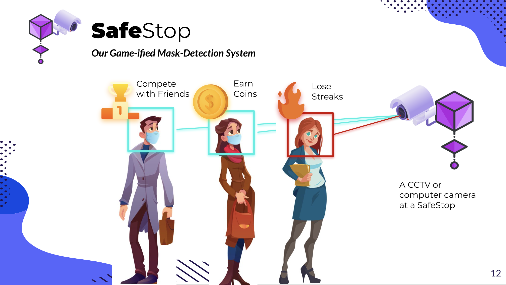
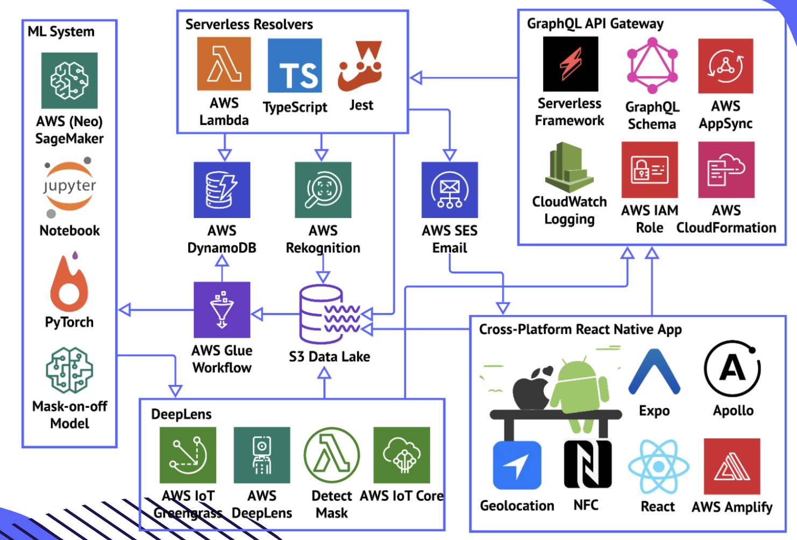
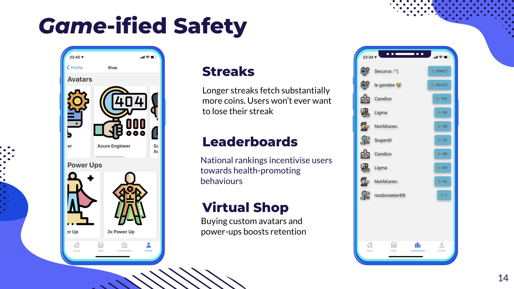
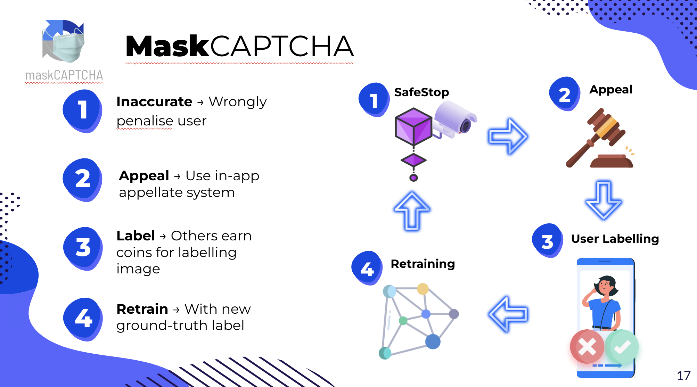

# 🛡️ Securus: AI Social Game for Wearing COVID-19 Masks

[Pitch deck 🔗](https://docs.google.com/presentation/d/1MAIT52MFhbN1uX9XmmIQg3aqlcEUnv7L/edit?usp=sharing&ouid=103478900344753254228&rtpof=true&sd=true) | [Whitepaper 🔗](https://docs.google.com/document/d/1NidxNuTBACGBXKFHXwR474I43ZVp3MI-/edit?usp=sharing&ouid=103478900344753254228&rtpof=true&sd=true)

**🦠 Problem Statement:** Ensuring mask compliance in public spaces remains a challenge in mitigating COVID-19 spread. Many existing solutions lack scalability, user engagement, and continuous improvement.

**🔒 Why Securus:** Securus offers a unique, scalable, and engaging solution to promote mask-wearing and identify non-compliant individuals. Our cutting-edge AI-driven detection system and gamification approach work in tandem to create a safer environment and incentivize responsible behavior.

## Impact 💪
Securus aims to:

1. Enforce mask-wearing effectively
2. Encourage local businesses and foot traffic
3. Reduce the need for human enforcement personnel
4. Create a safer environment for everyone

Our gamification features (leaderboards, point systems, group streaks) incentivize users to wear masks willingly and help enhance our mask detection system through community-driven image labeling.

## Architecture Overview

1. **React Native App:** Cross-platform app with AWS Amplify & background geolocation.

2. **API Gateway:** GraphQL API via AWS AppSync, Lambda resolvers, and CloudWatch logging.

3. **Data Storage:** AWS DynamoDB and RDS, secured by AWS IAM policies.

4. **ML Inference Model:** Data processed with AWS Glue, stored in an S3 data lake.

5. **AWS SageMaker:** CNN with PyTorch, AWS Rekognition for face detection, and Detectron2 for object detection.

6. **Optimized Model:** AWS SageMaker Neo for hardware optimization, deployed on DeepLens with IoT Greengrass.

7. **Event-driven System:** AWS Lambda, MQTT messaging, and SNS for notifications.

### Gamification & Mask Detection

🏆 Securus rewards users with points for mask compliance, offering streaks and leaderboards to encourage continued mask-wearing. The MaskCAPTCHA appellate system allows users to appeal incorrect detections, contributing to model improvement.

💡 This engaging approach not only promotes mask-wearing but also supports local businesses by encouraging users to visit public areas.

### Deep Learning & Model Retraining

🧠 Securus utilizes a deep learning model trained on mask-on and mask-off datasets. The event-driven serverless architecture leverages AWS SageMaker, Rekognition, and Detectron2 for mask and face detection. Low-confidence detections trigger retraining, ensuring constant model improvement.

🚀 By combining mask compliance gamification and AI-driven detection, Securus aims to create a safer and more resilient environment amidst the COVID-19 pandemic.

License: **MIT**

Credit: to my teammates at AWS BuildOn 2021 Hackathon, where we **won 1st across Southeast Asia**! (Nicole Chay, Jamie Wee, Lachlan Goh, Matthew Han)